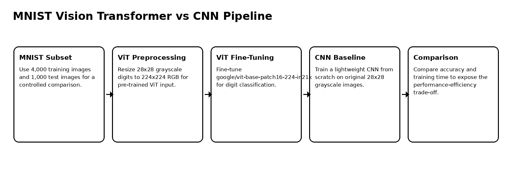
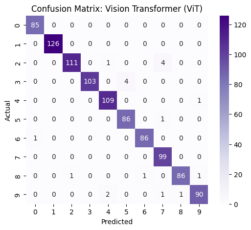
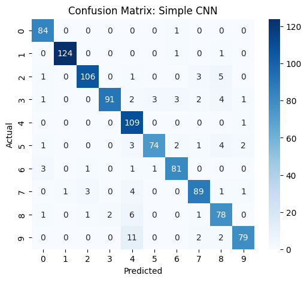
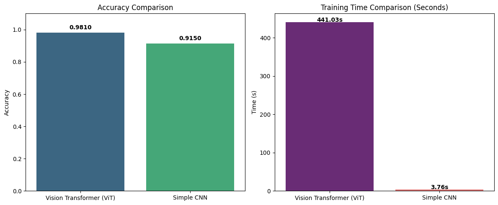

# MNIST Vision Transformer vs CNN Comparison

Computer-vision comparison between a fine-tuned Vision Transformer and a lightweight CNN baseline on an MNIST subset, focusing on accuracy and training-time trade-offs.

## Overview

This project compares two different approaches to image classification:

1. a pre-trained Vision Transformer fine-tuned for MNIST digit classification,
2. a simple CNN trained from scratch.

The goal is not only to maximize accuracy, but to understand the trade-off between transfer-learning performance and computational efficiency.

## Dataset

| Item | Details |
|---|---|
| Dataset | MNIST |
| Training subset | 4,000 images |
| Test subset | 1,000 images |
| Classes | Digits 0–9 |
| ViT preprocessing | Resize 28×28 grayscale to 224×224 RGB |
| CNN preprocessing | Keep 28×28 grayscale format |

## Workflow



## Results

| Model | Accuracy | Training time | Notes |
|---|---:|---:|---|
| Vision Transformer | 98.10% | 441.03 sec | Higher accuracy from transfer learning |
| Simple CNN | 91.50% | 3.76 sec | Much faster but lower accuracy |

The ViT outperformed the CNN by 6.6 percentage points, while the CNN trained around 117× faster.

## Interpretation

The Vision Transformer achieved near-perfect accuracy because it used a pre-trained model with strong visual representations. However, this came at a high computational cost. The simple CNN trained extremely quickly and still achieved a respectable 91.5% accuracy.

This makes the project a practical demonstration of the accuracy-efficiency trade-off in computer vision: ViT is preferable when accuracy is the priority and resources are available, while CNNs remain attractive for lightweight or resource-constrained settings.

## Visual Summary

| ViT confusion matrix | CNN confusion matrix |
|---|---|
|  |  |



## Key Findings

1. ViT delivered stronger classification performance than the CNN baseline.
2. Transfer learning made ViT effective even with a small subset.
3. CNN was dramatically faster and simpler to train.
4. Model choice should depend on accuracy requirements, latency, training cost, and deployment constraints.

## Repository Contents

```text
.
├── mnist_vit_cnn_comparison.ipynb
├── docs/
│   └── figures/
├── requirements.txt
├── .gitignore
└── README.md
```

## Run Locally

This repository is notebook-based. Create a clean Python environment, install the dependencies, then open the notebook.

### Windows PowerShell

```powershell
py -3.10 -m venv .venv
.\.venv\Scripts\Activate.ps1
python -m pip install --upgrade pip
pip install -r requirements.txt
```

### Linux / macOS

```bash
python3 -m venv .venv
source .venv/bin/activate
python -m pip install --upgrade pip
pip install -r requirements.txt
```


## Open the Notebook

```bash
jupyter notebook mnist_vit_cnn_comparison.ipynb
```

## Notes

The ViT experiment is GPU-oriented. The CNN baseline can run comfortably on CPU.
